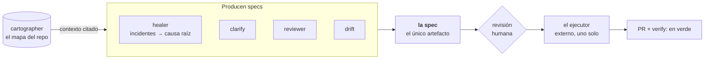

<div align="center">

<picture>
  <source media="(prefers-color-scheme: dark)" srcset="legiosdark.svg">
  <source media="(prefers-color-scheme: light)" srcset="legioslight.svg">
  
</picture>

### Que dos personas operen software que no les cabe en la cabeza

El sistema sabe lo que el equipo no puede sostener, y lo dice con citas.

<p>
  
  
  
  
</p>

</div>

Legios construye las piezas que hacen falta para que un cambio de software vaya
de **un síntoma** a **un PR mergeado** sin que una persona tenga que sostener el
sistema entero en la cabeza. No construimos un agente: el ejecutor es externo y
es uno solo. Construimos el contexto y la evidencia que un ejecutor necesita
para no equivocarse.

## Lo que podés correr hoy

<table>
<tr>
<td width="120" align="center" valign="middle">
  
</td>
<td valign="middle">

### [quartermaster](https://github.com/legiosai/quartermaster)

Cuánta cuota te queda en **todos** los perfiles de Claude Code de la máquina,
más Codex y los proveedores que guarda opencode.
**Público y MIT.** · [Sitio](https://legiosai.github.io/quartermaster/) ·
[Releases](https://github.com/legiosai/quartermaster/releases)

</td>
</tr>
</table>

```bash
brew install legiosai/tap/quartermaster    # macOS y Linux
sudo apt install quartermaster             # con el repo de Legios agregado
npm install -g @legios/quartermaster
```

<p align="center">
  
</p>

La fórmula de Homebrew vive en
[`homebrew-tap`](https://github.com/legiosai/homebrew-tap) — Homebrew exige que
un tap se llame así y sea público; son cuatro líneas y una suma de verificación.

El número **no necesita red ni credenciales**: sale del cache que Claude Code ya
dejó en el disco, así que se lee aunque el token esté vencido. Y salió de un
hallazgo que vale por sí solo: dentro de `cachedUsageUtilization` hay barras que
no tienen clave propia arriba. Leyendo sólo las dos famosas —`five_hour` y
`seven_day`— se veía 8 % y 59 % mientras la que realmente frenaba iba al 75 %
con aviso del servidor. **Un error de 67 puntos que se ve cómodo.**

## La arquitectura, en una línea

Hay **un solo artefacto** —la spec— y todo lo demás la produce o la consume.



Eso es lo que hace que las piezas sean independientes y conectables sin una
interfaz por cada par.

## Los tres repos

No hay nombres de producto separados. Hay tres repos y se llaman por lo que
hacen.

Los tres son **privados**: acá van descritos, no enlazados, para no mandarte a
un 404.

| Repo | Qué hace | Estado |
|---|---|---|
| `cartographer` | Convierte un repositorio en contexto simbólico consultable — stack, comandos, entry points, símbolos, referencias — sin tokens de modelo y sin red. | Vía C · C0–C9 hechos |
| `healer` | De incidentes reales a causas raíz citadas, y de ahí a una spec. El embudo colapsa N eventos en M causas, así que el modelo se llama por causa, no por evento. | Vía H · H0–H3, H5–H7 mergeados |
| `pipeline` | Spec → ejecutor libre → PR. El aislamiento (P5) está probado corriendo, en verde y en rojo. El north star —% de PRs mergeados sin reescritura— sigue **sin muestra**. | Fase C · P0–P6 cerrados; P7 abierto |

Además, también privados: `salvage` —lo que se rescató de v1, legible— y `web`
—la landing—.

## Cómo trabajamos

Cada hito tiene **tres cosas obligatorias**. Si le falta una, no está terminado.

1. **Una demo que se corre y se ve.** No una captura, no una descripción: un
   comando.
2. **Un gate de CI que se probó en rojo antes de confiar en él.** Si no podés
   mostrar el rojo, no tenés el gate.
3. **Un número comiteado.** En `numeros/`, fechado, con el método al lado.

Y una ceremonia de proceso que no se negocia: **el `SOUL.md` de cada repo,
lleno, antes de la primera línea de código.**

<details>
<summary><b>Los cuatro principios que se invocan a diario</b></summary>

<br>

Son tensiones, no eslóganes: cada uno decide una llamada ambigua. Éstos son los
cuatro que se invocan a diario.

1. **Memoria equivocada es peor que ninguna memoria.** Lo indetectable es
   `null`, no una suposición. Toda claim narrada lleva citas. Todo degrada a
   inspección viva, nunca por debajo.
2. **Ninguna capacidad se mergea sin su consumidor.** Si nadie la llama, no está
   terminada.
3. **Un gate se prueba fallando antes de confiar en él.** Tres meses de
   `continue-on-error: true` son tres meses de confianza construida sobre nada.
4. **Restringir el *qué*, liberar el *cómo*.** El contrato es el resultado, no
   el procedimiento.

</details>

<details>
<summary><b>Non-goals, cerrados</b> — cada uno es un error de v1 que no se repite</summary>

<br>

Cada uno es un error de v1 que no se repite. El detalle está en
`docs/legajo-2026-08-14/03-ERRORES-Y-PRINCIPIOS.md`.

- **Ningún agente con protocolo propio.** El ejecutor es externo y es uno.
- **Ninguna infraestructura antes de que haya algo que hostear.** Las Fases A
  y B corrieron enteras local-first, `npx` y GitHub Actions. La infra de AWS
  (P5: aislamiento del ejecutor; el sitio en S3 + CloudFront) recién entró en
  Fase C, cuando hubo algo real que aislar y algo real que servir — no antes.
- **Ningún conector más allá del primero de su clase.**
- **Ningún dashboard** hasta que haya tráfico *y* una persona concreta que vaya
  a leer un panel concreto para contestar una pregunta concreta.
- **Ningún nombre de producto separado** para una parte de un producto.

</details>

## Propiedad

**El núcleo es propietario.** Los tres repos de la arquitectura —cartographer,
healer, pipeline— son privados y siguen así: no hay frontera open-core que
mantener y no hay producto abierto, decidido el 2026-08-26.

Las **herramientas** son otra cosa. `quartermaster` es público y MIT porque no
es parte del producto: es un instrumento que hicimos para nosotros, que resuelve
un problema que tiene cualquiera que use estos CLIs, y que no revela nada del
núcleo. La regla es esa y no «todo abierto»: se publica lo que sirve suelto.

## Quiénes

Dos personas. Es el punto entero: la tesis de Legios es que dos personas puedan
operar software que no les cabe en la cabeza, y la primera prueba de que sirve
somos nosotros.

| | |
|---|---|
| **Valentín Torassa** · [@ValentinTorassa](https://github.com/ValentinTorassa) | Producto y ejecución. El healer y el pipeline. |
| **Sol Soletti** · [@solsolettidev](https://github.com/solsolettidev) | El cartógrafo y las superficies. |

Founder-led y de operación privada. Si algo de acá te sirve, el que se puede
usar hoy es [quartermaster](https://github.com/legiosai/quartermaster); lo demás
todavía no sale del taller.

<div align="center">
<br>
<sub>Construido por Valentín Torassa y Sol Soletti.</sub>
</div>
