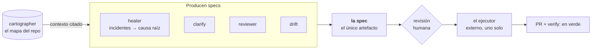

<div align="center">

<picture>
  <source media="(prefers-color-scheme: dark)" srcset="legiosdark.svg">
  <source media="(prefers-color-scheme: light)" srcset="legioslight.svg">
  
</picture>

### Todo empieza siendo algo que necesitábamos nosotros

<picture>
  <source media="(prefers-color-scheme: dark)" srcset="fichadark.svg">
  <source media="(prefers-color-scheme: light)" srcset="fichalight.svg">
  
</picture>

</div>

Somos dos personas. Cada repositorio que hay acá existe porque algo nos estaba
haciendo perder tiempo y en algún momento nos cansamos y lo arreglamos. Algunas
de esas cosas quedaron lo bastante bien como para que las use cualquiera, y ésas
son públicas. El resto se queda adentro, no porque sea secreto sino porque
todavía no anda solo.

Con el tiempo nos dimos cuenta de que casi todo lo que nos costaba era lo mismo
dicho de distintas maneras: había información que ya estaba en el disco y nadie
la miraba. Cuánta cuota quedaba. Qué comandos tiene este repo. De qué causa
salieron estos cuarenta incidentes. Las herramientas de acá son eso, mirar lo
que ya estaba ahí antes de llamar a un modelo o de pedirle a una persona que se
acuerde.

## Lo que podés usar hoy

<table>
<tr>
<td width="120" align="center" valign="middle">
  
</td>
<td valign="middle">

### [quartermaster](https://github.com/legiosai/quartermaster)

Cuánta cuota te queda en **todos** los perfiles de Claude Code de la máquina,
más Codex y los proveedores que guarda opencode.
**Público y MIT.** · [Sitio](https://legiosai.github.io/quartermaster/) ·
[Releases](https://github.com/legiosai/quartermaster/releases)

</td>
</tr>
</table>

Salió un día que nos quedamos sin cuota en la mitad de algo. La barra de arriba
decía 8 %. Cuando fuimos a ver, el cache de Claude Code tenía otra barra, sin
nombre, al 75 % y con aviso del servidor. Ninguna herramienta la mostraba porque
todas leen las dos que tienen nombre. Ésta lee todas, de todos los perfiles que
haya en la máquina, y no usa red ni credenciales: el número sale del cache que
Claude Code ya dejó en el disco, así que hay número aunque el token esté
vencido.

```bash
brew install legiosai/tap/quartermaster    # macOS
sudo apt install quartermaster             # Linux, con el repo de Legios agregado
npm install -g @legios/quartermaster       # cualquier sistema con Node
```

<p align="center">
  
</p>

La fórmula de Homebrew vive en
[`homebrew-tap`](https://github.com/legiosai/homebrew-tap) porque Homebrew exige
que un tap se llame así y sea público. Son cuatro líneas y una suma de
verificación; no hay nada más ahí.

## Lo que se queda adentro

Todo lo de esta sección es privado. Está descrito y no enlazado para no mandarte
a un 404, y el estado lleva fecha —**2026-09-10**— porque un estado sin fecha
envejece mintiendo.

**`cartographer`** · Un agente en un repo nuevo gasta la mayor parte de
sus llamadas en `ls`, `grep` y leer configs para enterarse de cosas que el repo
ya sabe de sí mismo. El cartógrafo calcula eso una vez —stack, comandos, entry
points, símbolos, referencias— sin modelo y sin red, y lo deja en un mapa que
se consulta. Lo que no puede saber lo deja en `null`, no lo adivina.
*Vía C, C0 a C9 hechos.*

**`healer`** · Nadie quería seguir persiguiendo tracebacks a mano.
Toma incidentes reales, los agrupa por causa en vez de por evento, arma un
legajo con citas al código y recién ahí llama al modelo, una vez por grupo. Del
otro lado sale una spec, nunca un merge: es lo único de acá que se dispara solo
sin una persona adelante, y por eso no toca `main`.
*Vía H, H0 a H3 y H5 a H7 mergeados. Veintisiete hipótesis esperan revisión
humana; la tasa de aceptación todavía es `null`.*

**`pipeline`** · En la versión anterior teníamos veintiséis agentes. La
mayoría eran funciones con nombre de persona: uno abría PRs, otro leía issues,
otro miraba checks. Ahora hay un solo ejecutor, externo, que recibe una spec y
devuelve un PR, y el aislamiento donde corre se probó en verde y en rojo.
*Fase C, P0 a P6 cerrados, P7 abierto. El north star —PRs mergeados sin que
un humano reescriba el cambio— sigue sin muestra. La línea base que heredamos
era 4 %.*

**`hardware`** · Una pantalla chica sobre el escritorio que muestra lo que está
pasando sin que la abras. El servidor renderiza, la pantalla dibuja, y cada
unidad en campo es un nodo más que el healer lee. Todavía es un prototipo:
la placa está elegida y verificada en un carrito local, el firmware compila
pero nunca corrió en la placa, y la caja es un DXF sin mediciones físicas.
*Cero señas. Hay una regla escrita antes de la primera compra: diez señas o no
hay lote.*

**`videogame`** · Un juego para gente que no tiene atención. Corre en la
terminal, la nave vuela sola, la tripulación trae salvamento cada minuto y vos
mirás cada tanto para gastarlo en uno de los seis cuartos. Nada que leer, nada
que contestar, y siguen trabajando horas después de que lo cerrás. Si la
terminal no soporta imágenes cae a celdas de color, y si no, a ASCII, antes que
dibujar mal.
*Prueba P0 en Rust, en verde. Título de trabajo: Wayfarer.*

**`architecture`** y **`web`** · Los ADR, los hallazgos y el legajo del
reinicio —por qué las cosas son como son— y la landing.

## Cómo se conectan las tres del medio

Hay **un solo artefacto**, la spec, y todo lo demás la produce o la consume.
Es lo que hace que las piezas sean independientes y se conecten sin una
interfaz por cada par.



## Cómo trabajamos

Un hito no está terminado hasta que tiene tres cosas, y ninguna se negocia.

1. **Una demo que se corre y se ve.** Un comando, no una captura.
2. **Un gate de CI que vimos fallar antes de confiarle algo.** Si no podés
   mostrar el rojo, no tenés el gate. Ya pasamos tres meses con
   `continue-on-error: true` creyendo que teníamos uno.
3. **Un número comiteado.** En `numeros/`, con fecha y con el método al lado.

Y cada vía lleva una apuesta que puede perder, escrita antes de empezar. La del
healer, textual de su `SOUL.md`:

> Si los humanos rechazan la hipótesis de causa raíz agrupada más veces de las
> que la aceptan, agrupar no aporta nada y esto es un bot de error-a-issue.

Está redactada así a propósito. Dice cómo se vería que no funcione, que es lo
que hace que sea una apuesta y no una intención.

<details>
<summary><b>Los cuatro principios que se invocan a diario</b></summary>

<br>

Son tensiones, no eslóganes: cada uno decide una llamada ambigua.

1. **Memoria equivocada es peor que ninguna memoria.** Lo indetectable es
   `null`, no una suposición. Toda claim narrada lleva citas. Todo degrada a
   inspección viva, nunca por debajo.
2. **Ninguna capacidad se mergea sin su consumidor.** Si nadie la llama, no está
   terminada.
3. **Un gate se prueba fallando antes de confiar en él.** Tres meses de
   `continue-on-error: true` son tres meses de confianza construida sobre nada.
4. **Restringir el *qué*, liberar el *cómo*.** El contrato es el resultado, no
   el procedimiento.

</details>

<details>
<summary><b>Non-goals, cerrados</b> — cada uno es un error de v1 que no se repite</summary>

<br>

El detalle está en `docs/legajo-2026-08-14/03-ERRORES-Y-PRINCIPIOS.md`.

- **Ningún agente con protocolo propio.** El ejecutor es externo y es uno.
- **Ninguna infraestructura antes de que haya algo que hostear.** Las Fases A
  y B corrieron enteras local-first, `npx` y GitHub Actions. La infra de AWS
  recién entró en Fase C, cuando hubo algo real que aislar y algo real que
  servir.
- **Ningún conector más allá del primero de su clase.** v1 tuvo nueve
  conectores de tracker con cero uso.
- **Ningún dashboard** hasta que haya tráfico *y* una persona concreta que vaya
  a leer un panel concreto para contestar una pregunta concreta.
- **Ningún nombre de producto separado** para una parte de un producto. Las
  cosas se llaman por lo que hacen.

</details>

## Qué es público y qué no

El núcleo —cartographer, healer, pipeline— es propietario y sigue así. No hay
frontera open-core que mantener porque no hay producto abierto; se decidió el
2026-08-26.

Las herramientas son otra cosa. `quartermaster` es público y MIT porque no
forma parte del producto: es algo que hicimos para nosotros, que le sirve a
cualquiera que use estos CLIs, y que no revela nada del núcleo. Ésa es la
regla, y no «todo abierto»: se publica lo que sirve suelto.

## Quiénes

Dos personas, y todo lo que hay acá lo escribimos entre los dos.

**Valentín Torassa** · [@ValentinTorassa](https://github.com/ValentinTorassa)<br>
**Sol Soletti** · [@solsolettidev](https://github.com/solsolettidev)

Founder-led y de operación privada. Si algo de acá te sirve, lo que se puede
usar hoy es [quartermaster](https://github.com/legiosai/quartermaster); lo
demás todavía no sale del taller.

<div align="center">
<br>
<sub>Construido por Valentín Torassa y Sol Soletti.</sub>
</div>
